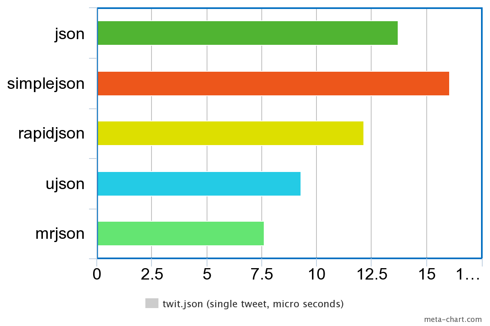
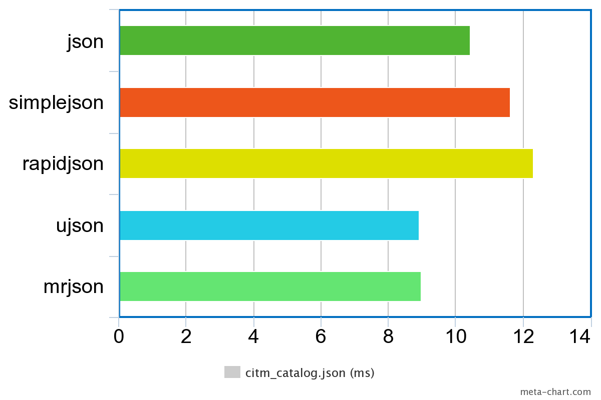
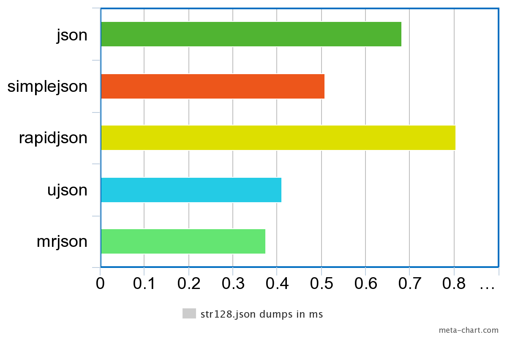
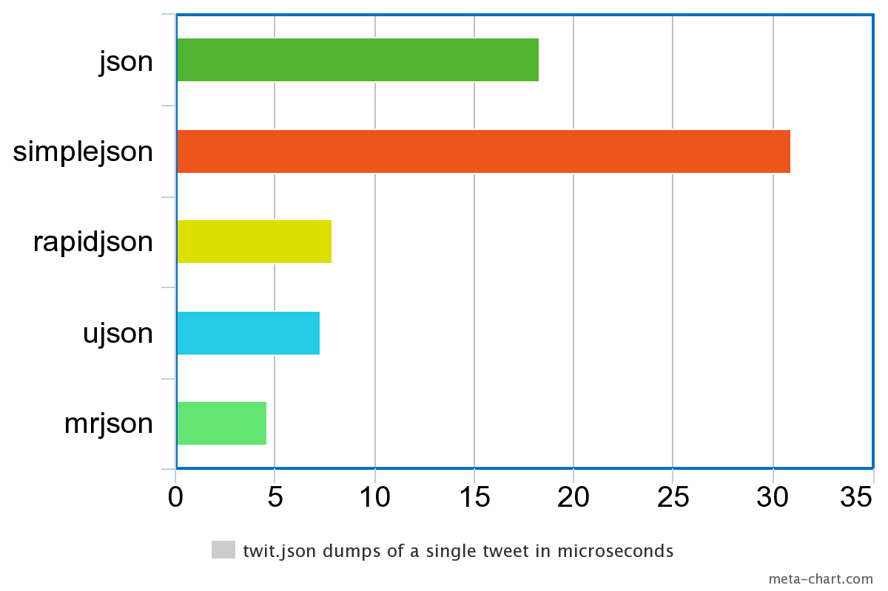
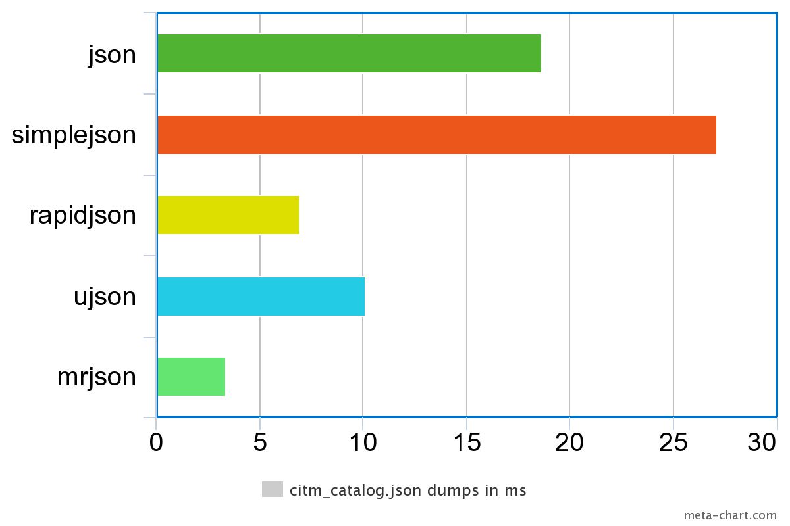

## MrJSON

MrJSON is a JSON encoder and decoder written in C/C++ with bindings for Python 2.5+ and 3.  I needed faster performance for long strings and floats and MrJSON benchmarks at 2-3 times faster than the fastest python parsers for my use cases.

To install it just run Pip as usual:

```sh
    $ pip install mrjson
```

## Usage

May be used as a drop in replacement for most other JSON parsers for Python:

```python
    >>> import mrjson
    >>> mrjson.dumps([{"key": "value"}, 81, True])
    '[{"key":"value"},81,true]'
    >>> mrjson.loads("""[{"key": "value"}, 81, true]""")
    [{'key': 'value'}, 81, True]
```

## Encoder options

### ensure_ascii

Note that this defaults to true in the base json module, but now defaults to false for space and performance reasons. When true the output is ASCII with unicode characters embedded as \uXXXX and when false the output is a UTF-8 unicode string.

## Benchmarks		

Run bench.py to test MrJSON against some other modules - add your own json files and test on your own machine. MrJSON does particularly well with long strings and floating point data. 

#### Loads

Only 128 byte long strings. 


Mostly floating point numbers - canada.json from [The Native JSON Benchmark](https://github.com/miloyip/nativejson-benchmark)


A single tweet from twitter - twit.json



citm_catalog.json from [The Native JSON Benchmark](https://github.com/miloyip/nativejson-benchmark)



#### Dumps

Only 128 byte long strings. 



Mostly floating point numbers - canada.json from [The Native JSON Benchmark](https://github.com/miloyip/nativejson-benchmark)


A single tweet from twitter - twit.json



citm_catalog.json from [The Native JSON Benchmark](https://github.com/miloyip/nativejson-benchmark)



